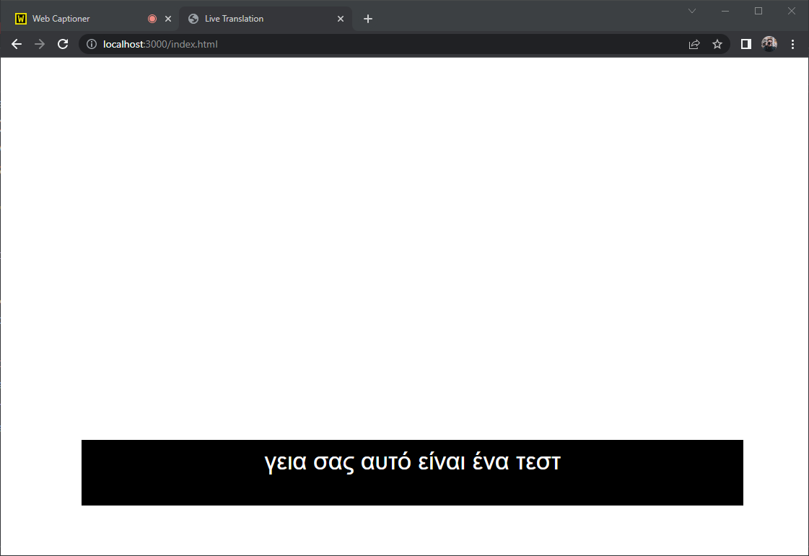

# Web Captioner Translator

This is a proof-of-concept repository that converts transcribed captions generated by [Web Captioner](https://webcaptioner.com)
into other languages using the Google Scripts API.



## Setup

To use this script, you need to prepare NodeJS, Web Captioner, and a Google Script Project.

### Google Apps Script

1. Open https://script.google.com/ and create a new project
2. Delete all text and paste the following code into the new script:
    ```javascript
    // This script receives the text to be translated, the original language and the destination language
    // It calls google translator and returns the translated text.
    // As found on https://github.com/tanabee/google-translation-api/blob/master/code.js

    function doGet(e) {
    var p = e.parameter;
    var translatedText = LanguageApp.translate(p.text, p.source, p.target);
    return ContentService.createTextOutput(translatedText);
    }
    ```
3. Save the project
4. Select **Deploy**, then **New deployment** and create a **Web App**
5. Save the **Deployment ID**, it will be used later

### NodeJS server

Make sure you have a reasonably recent version of node and npm installed.
To install all dependencies, run:
```bash
npm install
```

Set up your configuration options (deployment ID, source and target languages) in `index.js`.

To start the server, run:
```bash
npm start
```

You can then access the generated page at `http://address:3000/index.html`. This page provides a transparent
background, allowing easy integration with OBS Studio and other broadcasting software.

### Web Captioner

In webcaptioner.com, go to the **Settings** into the **Channels** option, and enable a **Webhook**.
Configure the webhook with the following options:
- **URL**: `http://address:3000/hook`
- **Chunking**: A suitable number of words for each subtitle. A number between 10-30 should work depending on the content.

## Usage

After having configured all of the above, subtitles should start updating at:
```
http://address:3000/
```

## Similar projects
- [OBS-live-translation](https://github.com/eddieoz/OBS-live-translation), which was an inspiration for this project